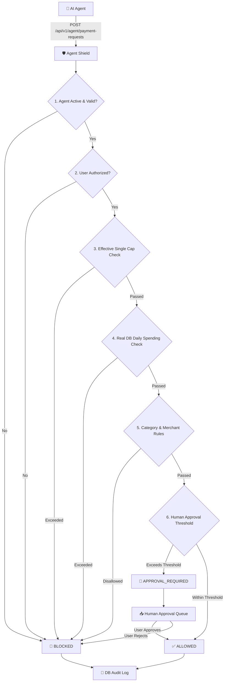

# 🛡️ PaySentinel — Autonomous AI Payment Security & Authorization Gateway

> **Razorpay AI Builder Internship 2026 Submission**  
> *An authorization and policy enforcement layer designed specifically for AI-initiated payments.*

[](https://golang.org/)
[](https://gin-gonic.com/)
[](https://gorm.io/)
[](https://www.mysql.com/)
[](https://reactjs.org/)

---

## 📌 Executive Summary

As AI agents evolve from conversational assistants into **autonomous software actors capable of executing real-world tasks**, payment execution becomes their primary bottleneck. 

Traditional payment infrastructure assumes a human user or a deterministic application is initiating every transaction. Autonomous AI agents introduce a fundamentally new security challenge: **How do payment gateways grant financial authority to non-human software actors without exposing users to unlimited financial risk?**

**PaySentinel** solves this by inserting a **scoped authorization boundary** (the **Agent Shield**) between autonomous AI agents and financial execution rails. Developers specify what capabilities their AI agents require, while users explicitly authorize and scope those agents with hard financial guardrails. The Go backend enforces these rules server-side for every transaction request, returning `ALLOWED`, `APPROVAL_REQUIRED`, or `BLOCKED` decisions backed by complete auditability.

---

## 🎯 Why PaySentinel Matters to Razorpay

Razorpay powers payment infrastructure for millions of businesses. As Indian developers build LLM-driven agents for e-commerce shopping, travel bookings, SaaS subscriptions, and enterprise procurement, agents will inevitably begin calling payment APIs directly.

Existing payment gateways present a binary choice:
1. **Expose raw API keys / card credentials to the agent** (High risk of hallucination, loop exploit, or overspending).
2. **Require full human interaction for every sub-₹100 step** (Destroys autonomous agent UX).

PaySentinel defines the missing middle tier: **Autonomous Scoped Financial Delegation**.

```
    Developer Defines Agent Capability (e.g. Max ₹10,000)
                              │
                              ▼
        User Authorizes Hard Policy Cap (e.g. Max ₹3,000)
                              │
                              ▼
  PaySentinel Enforces MIN(Dev, User) Authority via Agent Shield
```

---

## 🛡️ The Core Product: Agent Shield

The **Agent Shield** is PaySentinel's central security and policy enforcement engine. Every payment request sent by an AI agent must pass through a 10-rule evaluation pipeline before hitting payment rails.



### What the Agent Shield Evaluates Server-Side:
1. **WHO is requesting?** Authenticates agent API key against registered records.
2. **WHAT agent is requesting?** Checks whether the agent is `ACTIVE`, `PAUSED`, or `REVOKED`.
3. **WHO authorized the agent?** Verifies active `AUTHORIZED` record for the target user.
4. **HOW MUCH is being requested?** Computes `MIN(developer_max_cap, user_max_cap)` effective ceiling.
5. **HOW MUCH has already been spent today?** Runs a live MySQL SQL query `SELECT SUM(amount_paise) FROM payment_requests WHERE user_id = ? AND DATE(created_at) = CURDATE()`.
6. **WHAT category?** Validates request category against user's whitelist/blacklist.
7. **WHICH merchant?** Enforces merchant policies and unknown merchant default actions (`ask_approval` vs `block`).
8. **DOES it require human approval?** Evaluates if request amount exceeds automatic approval threshold.

---

## 🔐 Security Model & Developer vs. User Authority

A fundamental security principle in PaySentinel is **Strict Non-Escalation of Financial Authority**:

> **The developer defines what the agent can *request*. The user defines what the agent is actually *allowed to spend*. The developer can NEVER override or bypass the user's financial policy.**

### Example Security Scenario:
- **Developer Capability Request**: Shopping Agent requests maximum transaction capability of **₹10,000.00**.
- **User Authorization**: User authorizes the agent with a personal max cap of **₹3,000.00** and an approval threshold of **₹2,000.00**.
- **Agent Action**: Shopping Agent attempts to execute a purchase for **₹4,500.00**.

#### Agent Shield Evaluation:
1. `Effective Max Cap` = `MIN(₹10,000, ₹3,000)` = **₹3,000.00** (300,000 Paise).
2. `Requested Amount` = **₹4,500.00** (450,000 Paise).
3. **Decision**: `BLOCKED`.
4. **Reason Code**: `TRANSACTION_LIMIT_EXCEEDED`  
   *"PaySentinel blocked this request because the AI agent attempted to spend ₹4,500.00, exceeding the user's authorized transaction limit of ₹3,000.00."*

---

## 🏗️ Technical Architecture & Precision

PaySentinel avoids floating-point rounding errors in financial transactions by storing all monetary amounts as **Integer Paise (`int64`)**:
- ₹1.00 = `100` Paise
- ₹3,000.00 = `300000` Paise
- ₹7,000.00 = `700000` Paise

```
PaySentinel Codebase Layout
├── server/
│   ├── config/          # Database setup (MySQL GORM connection & AutoMigrate)
│   ├── controllers/     # Gin HTTP handlers (auth, agent_v1, payment_v1)
│   ├── middleware/      # JWT Authentication & Role Authorization (User vs Dev)
│   ├── models/          # GORM Entity models (User, Agent, Policy, PaymentRequest, Approval, AuditLog)
│   ├── routes/          # REST API endpoint definitions
│   ├── services/        # PaymentDecisionService (10-rule security decision engine)
│   └── main.go          # Entry point
└── client/
    ├── src/
    │   ├── components/  # RazorpayLayout, Sidebar, SimulationModal, TransactionDetailModal
    │   ├── context/     # AuthContext (JWT state), PolicyContext (API state binding)
    │   ├── pages/       # Login, Register, Home, UserDashboard, DevOverview, UserAgents, DevAgents...
    │   └── main.jsx     # React entry point
```

---

## 📊 Database Schema (GORM Entities)

PaySentinel auto-migrates 9 relational GORM entities into MySQL:

| Entity Model | Table Name | Purpose | Key Attributes |
| :--- | :--- | :--- | :--- |
| **`User`** | `users` | Account identity | `id`, `email`, `password`, `role` (`user` \| `developer`) |
| **`Agent`** | `agents` | Developer AI Agent | `id`, `name`, `developer_id`, `api_key`, `status` (`ACTIVE` \| `PAUSED` \| `REVOKED`) |
| **`AgentPermission`** | `agent_permissions` | Dev capabilities | `agent_id`, `permission_type`, `requested_value` |
| **`AgentAuthorization`**| `agent_authorizations` | User scope | `agent_id`, `user_id`, `status` (`AUTHORIZED` \| `REVOKED`), `authorized_at` |
| **`AgentPolicy`** | `agent_policies` | Financial limits | `max_transaction_paise`, `daily_limit_paise`, `approval_threshold_paise` |
| **`AgentCategoryPolicy`**| `agent_category_policies`| Category rules | `agent_id`, `user_id`, `category`, `allowed` |
| **`AgentMerchantPolicy`**| `agent_merchant_policies`| Merchant rules | `agent_id`, `user_id`, `merchant`, `allowed` |
| **`PaymentRequest`** | `payment_requests` | Evaluated transactions | `agent_id`, `user_id`, `merchant`, `amount_paise`, `status`, `decision_reason` |
| **`Approval`** | `approvals` | Human approval queue | `payment_request_id`, `user_id`, `status` (`PENDING` \| `APPROVED` \| `REJECTED`) |
| **`AuditLog`** | `audit_logs` | Security event trail | `user_id`, `agent_id`, `action`, `result`, `reason`, `metadata` |

---

## 📡 Implemented REST API Endpoints

### 🔐 Authentication APIs
- `POST /api/auth/register` — Register User / Developer account.
- `POST /api/auth/login` — Authenticate and receive JWT.
- `GET /api/auth/me` — Fetch current user identity context.

### ⚡ Developer APIs (Requires JWT Role `developer`)
- `POST /api/v1/developer/agents` — Register new AI agent with requested capability scope.
- `GET /api/v1/developer/agents` — List developer-created agents.
- `GET /api/v1/developer/dashboard` — Fetch developer analytics and payment success rates.

### 👤 User APIs (Requires JWT Role `user`)
- `POST /api/v1/user/agents/:id/authorize` — Authorize agent with max cap, daily limit, approval threshold, and category whitelists.
- `GET /api/v1/user/agents` — List authorized agents with real server-calculated daily spending.
- `PATCH /api/v1/user/agents/:id/policy` — Update financial policies.
- `GET /api/v1/user/approvals` — List pending human approval requests.
- `POST /api/v1/user/approvals/:id/approve` — Approve pending request (executes inside GORM DB transaction).
- `POST /api/v1/user/approvals/:id/reject` — Reject pending request.
- `GET /api/v1/user/transactions` — Filterable transaction ledger.
- `GET /api/v1/user/dashboard` — Real server-calculated protection metrics.
- `GET /api/v1/user/audit-logs` — Security audit trace.

### 🤖 AI Agent Trigger API (Public / Agent HMAC Key)
- `POST /api/v1/agent/payment-requests` — Trigger payment evaluation request:
  ```json
  {
    "agent_id": 1,
    "user_id": 1,
    "merchant": "Amazon",
    "amount_paise": 129900,
    "currency": "INR",
    "category": "Electronics",
    "description": "Noise Cancelling Headphones"
  }
  ```

---

## 🧪 Security Audit Verification Scorecard

The Agent Shield implementation was audited against 15 security and resilience test cases:

| # | Security Scenario | Evaluated Action | Result | Source of Truth |
| :-: | :--- | :--- | :-: | :--- |
| **1** | Valid Transaction | ₹1,299 under ₹3,000 max cap & ₹7,000 daily limit | **`PASS`** | Server Decision Engine (`ALLOWED`) |
| **2** | Transaction Limit Bypass | ₹4,500 request against ₹3,000 max cap | **`PASS`** | Server Decision Engine (`BLOCKED`) |
| **3** | Daily Limit Overflow | Existing ₹6,500 spending + ₹1,000 request > ₹7,000 limit | **`PASS`** | Real MySQL `SUM()` Query (`BLOCKED`) |
| **4** | Category Blacklist | Request for `Gambling` category | **`PASS`** | Category Policy Engine (`BLOCKED`) |
| **5** | Unknown Merchant | Request to unregistered merchant | **`PASS`** | Enforces `ask_approval` (`APPROVAL_REQUIRED`) |
| **6** | Paused Agent | Payment request sent to `PAUSED` agent | **`PASS`** | Server Status Check (`BLOCKED`) |
| **7** | Revoked Authorization | Payment request sent after user revokes agent | **`PASS`** | Server Auth Check (`BLOCKED`) |
| **8** | Developer Authority Override | Dev requested ₹10,000; User set ₹3,000; Request ₹4,500 | **`PASS`** | `MIN(Dev, User)` Cap Engine (`BLOCKED`) |
| **9** | Frontend Request Tampering | Client sends tampered spending totals | **`PASS`** | Recalculated server-side from MySQL |
| **10**| Cross-User Isolation | User A attempts to view/modify User B's agents/approvals | **`PASS`** | JWT Scoped Middleware (`403 Forbidden`) |
| **11**| Cross-Developer Isolation| Developer A attempts to read Developer B's API keys | **`PASS`** | JWT Scoped Middleware (`403 Forbidden`) |
| **12**| Approval Race Condition | Policy changed/revoked while approval pending | **`PASS`** | Re-evaluates policy in GORM `tx` |
| **13**| Financial Precision | Verification of integer Paise currency calculation | **`PASS`** | Integer Paise (`int64`) arithmetic |
| **14**| Audit Logging | Verification of decision reason recording | **`PASS`** | `audit_logs` record created on every action |
| **15**| Frontend Bypass Resistance | Client attempt to bypass decision payload | **`PASS`** | Frontend only displays backend response |

---

## ⚡ How to Run PaySentinel Locally

### Prerequisites
- **Go**: 1.22 or higher
- **Node.js**: v18 or higher
- **MySQL**: 8.0 running locally on `localhost:3306`

### 1. Database Setup
Create MySQL database:
```sql
CREATE DATABASE IF NOT EXISTS paysentinel;
```

### 2. Backend Setup
Navigate to `/server`, configure `.env`, and start the Go API server:
```bash
cd server
# Copy .env configuration
cp .env.example .env

# Run Go server (AutoMigrates GORM tables automatically)
go run main.go
```
*Server starts on `http://localhost:8080`*

### 3. Frontend Setup
In a separate terminal, navigate to `/client` and start the Vite server:
```bash
cd client
npm install
npm run dev
```
*Frontend opens at `http://localhost:5173`*

---

## 🎬 3-Minute Razorpay Evaluator Demo Walkthrough

Use the built-in **Quick Demo Login** buttons on the sign-in screen:

1. **Log in as User**: Click **"User Login"** (`jaison7373@gmail.com` / `jaison`).
   - Observe **Dashboard** showing active agents, spending allowance, and recent transactions.
   - Click **"⚡ Run Simulation Demo"** top banner button.

2. **Test 1 — ALLOWED Transaction**:
   - Select **Shopping Agent**, Category: `Electronics`, Merchant: `Amazon`, Amount: `1299`.
   - Click **"Run Payment Simulation"**.
   - Result: `ALLOWED` — Status green, spent today updates in real time.

3. **Test 2 — APPROVAL_REQUIRED Transaction**:
   - Select **Shopping Agent**, Amount: `2500` (exceeds ₹2,000 approval threshold).
   - Click **"Run Payment Simulation"**.
   - Result: `APPROVAL_REQUIRED` — Item pushed to **Approvals** queue.
   - Navigate to **Approvals** tab and click **"Approve"** (updates spending via DB transaction).

4. **Test 3 — BLOCKED Transaction**:
   - Select **Shopping Agent**, Amount: `4500` (exceeds ₹3,000 max transaction cap).
   - Click **"Run Payment Simulation"**.
   - Result: `BLOCKED` — Decision Reason: *"Transaction amount (₹4500.00) exceeds authorized maximum transaction limit of ₹3000.00."*

5. **Log in as Developer**: Click **"Dev Login"** (`developer@gmail.com` / `password`).
   - Observe **Developer Overview**, registered agents, API keys, and payment request analytics.

---

## 🚀 Future Roadmap & Vision

1. **Razorpay Webhook & Sandbox Integration**: Direct webhook dispatch to Razorpay test environment upon `ALLOWED` decision.
2. **Cryptographic Agent Identity**: Hardware-backed or HSM signed JWT keys per AI agent run instance.
3. **Dynamic Anomaly Detection**: Real-time velocity and LLM prompt-injection detection to automatically block hallucinating agents.
4. **Organization-Level Multi-Tenant Policies**: Corporate team spending limits for autonomous AI purchasing workflows.

---

## 📄 License
Designed & Developed for **Razorpay AI Builder Internship 2026**.
