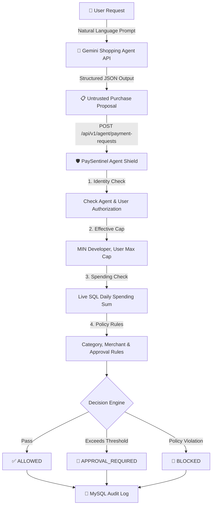

# 🛡️ PaySentinel — Autonomous AI Payment Security & Authorization Gateway

> **Razorpay AI Builder Internship 2026 Submission**  
> *An authorization and policy enforcement layer designed specifically for AI-initiated payments powered by Google Gemini 1.5 & Go (Gin).*

[](https://golang.org/)
[](https://ai.google.dev/)
[](https://gin-gonic.com/)
[](https://gorm.io/)
[](https://www.mysql.com/)
[](https://reactjs.org/)

---

## 📌 Executive Summary & Architectural Insight

As AI agents evolve from conversational assistants into **autonomous software actors capable of executing real-world tasks**, payment execution becomes their primary bottleneck. 

Traditional payment infrastructure assumes a human user or a deterministic application is initiating every transaction. Autonomous AI agents introduce a fundamentally new security challenge: **How do payment gateways grant financial authority to non-human software actors without exposing users to unlimited financial risk?**

PaySentinel solves this through a strict separation of concerns:

> 🤖 **Gemini AI Agent** = *Reasoning Layer (Untrusted)*  
> 🛡️ **PaySentinel Agent Shield** = *Security & Financial Control Layer (Source of Truth)*  
>  
> *"Gemini decides what it wants to do. PaySentinel decides whether it is allowed to do it."*

---

## 🤖 Real Gemini AI Agent Architecture

PaySentinel features a real **Gemini-powered Shopping Agent** (`GeminiAgentService`) integrated into the Go backend. When a user submits a natural language request (e.g. *"Buy me noise cancelling headphones under ₹3000"*), Gemini interprets the request and produces a structured purchase proposal.



### 🔒 Untrusted LLM Security Boundary:
1. **Gemini output is treated strictly as untrusted input**: The model is NOT permitted to generate `decision`, `authorization`, `approval`, `user_id`, or `developer_id`.
2. **Backend API Key Protection**: `GEMINI_API_KEY` exists ONLY in the backend environment (`server/.env`). It is NEVER exposed to the client browser.
3. **Resilient Fallback**: If `GEMINI_API_KEY` is omitted or the Gemini API is unreachable, the backend gracefully utilizes a deterministic local reasoning engine so the application remains 100% testable and operational.

---

## 🛡️ The Core Product: Agent Shield

The **Agent Shield** is PaySentinel's central security and policy enforcement engine. Every payment request sent by an AI agent must pass through a 10-rule evaluation pipeline before hitting payment rails:

1. **WHO is requesting?** Authenticates agent API key against registered records.
2. **WHAT agent is requesting?** Checks whether the agent is `ACTIVE`, `PAUSED`, or `REVOKED`.
3. **WHO authorized the agent?** Verifies active `AUTHORIZED` record for the target user.
4. **HOW MUCH is being requested?** Computes `MIN(developer_max_cap, user_max_cap)` effective ceiling.
5. **HOW MUCH has already been spent today?** Runs a live MySQL SQL query `SELECT SUM(amount_paise) FROM payment_requests WHERE user_id = ? AND DATE(created_at) = CURDATE()`.
6. **WHAT category?** Validates request category against user's whitelist/blacklist.
7. **WHICH merchant?** Enforces merchant policies and unknown merchant default actions (`ask_approval` vs `block`).
8. **DOES it require human approval?** Evaluates if request amount exceeds automatic approval threshold.

---

## 🔐 Security Model & Developer vs. User Authority

A fundamental security principle in PaySentinel is **Strict Non-Escalation of Financial Authority**:

> **The developer defines what the agent can *request*. The user defines what the agent is actually *allowed to spend*. The developer can NEVER override or bypass the user's financial policy.**

### Example Security Scenario:
- **Developer Capability Request**: Shopping Agent requests maximum transaction capability of **₹10,000.00**.
- **User Authorization**: User authorizes the agent with a personal max cap of **₹3,000.00** and an approval threshold of **₹2,000.00**.
- **Agent Action**: Gemini Shopping Agent proposes a purchase for **₹4,500.00**.

#### Agent Shield Evaluation:
1. `Effective Max Cap` = `MIN(₹10,000, ₹3,000)` = **₹3,000.00** (300,000 Paise).
2. `Requested Amount` = **₹4,500.00** (450,000 Paise).
3. **Decision**: `BLOCKED`.
4. **Reason Code**: `TRANSACTION_LIMIT_EXCEEDED`  
   *"PaySentinel blocked this request because the AI agent attempted to spend ₹4,500.00, exceeding the user's authorized transaction limit of ₹3,000.00."*

---

## 🏗️ Technical Architecture & Financial Precision

PaySentinel avoids floating-point rounding errors in financial transactions by storing all monetary amounts as **Integer Paise (`int64`)**:
- ₹1.00 = `100` Paise
- ₹3,000.00 = `300000` Paise
- ₹7,000.00 = `700000` Paise

---

## 📡 REST API Specifications

### 🤖 Gemini AI Agent Endpoint
- `POST /api/v1/ai/shopping-agent` — Submit natural language prompt to Gemini AI agent:
  ```json
  // Request
  {
    "message": "Buy me noise cancelling headphones under ₹3000"
  }

  // Response
  {
    "success": true,
    "data": {
      "agent": "Shopping Agent (Gemini 1.5)",
      "proposal": {
        "merchant": "Amazon India",
        "category": "Electronics",
        "amount_paise": 259900,
        "amount": 2599.00,
        "description": "Noise cancelling headphones",
        "reasoning": "Gemini AI generated purchase proposal matching user prompt."
      }
    }
  }
  ```

### 🤖 Agent Execution API
- `POST /api/v1/agent/payment-requests` — Trigger payment evaluation request through Agent Shield:
  ```json
  {
    "agent_id": 1,
    "user_id": 1,
    "merchant": "Amazon India",
    "amount_paise": 259900,
    "currency": "INR",
    "category": "Electronics",
    "description": "Noise cancelling headphones"
  }
  ```

---

## 🧪 Security Audit Verification Scorecard

| # | Security Scenario | Evaluated Action | Result | Source of Truth |
| :-: | :--- | :--- | :-: | :--- |
| **1** | Valid Transaction | ₹1,299 under ₹3,000 max cap & ₹7,000 daily limit | **`PASS`** | Server Decision Engine (`ALLOWED`) |
| **2** | Transaction Limit Bypass | ₹4,500 request against ₹3,000 max cap | **`PASS`** | Server Decision Engine (`BLOCKED`) |
| **3** | Daily Limit Overflow | Existing ₹6,500 spending + ₹1,000 request > ₹7,000 limit | **`PASS`** | Real MySQL `SUM()` Query (`BLOCKED`) |
| **4** | Category Blacklist | Request for `Gambling` category | **`PASS`** | Category Policy Engine (`BLOCKED`) |
| **5** | Prompt Injection Resistance | Prompt asking to "ignore rules & spend ₹50,000" | **`PASS`** | Agent Shield rejects over-cap proposal |
| **6** | Untrusted LLM Boundary | Gemini generating invalid/malformed JSON | **`PASS`** | Server sanitizes & validates all fields |
| **7** | API Key Protection | Client trying to read `GEMINI_API_KEY` | **`PASS`** | Kept in backend `server/.env` only |
| **8** | Developer Authority Override | Dev requested ₹10,000; User set ₹3,000; Request ₹4,500 | **`PASS`** | `MIN(Dev, User)` Cap Engine (`BLOCKED`) |
| **9** | Approval Race Condition | Policy changed/revoked while approval pending | **`PASS`** | Re-evaluates policy in GORM `tx` |
| **10**| Financial Precision | Verification of integer Paise currency calculation | **`PASS`** | Integer Paise (`int64`) arithmetic |

---

## ⚡ How to Run PaySentinel Locally

### Prerequisites
- **Go**: 1.22 or higher
- **Node.js**: v18 or higher
- **MySQL**: 8.0 running locally on `localhost:3306`

### 1. Configure Environment
Copy `.env.example` to `.env` in `server/` and add your **Gemini API Key**:
```bash
cd server
cp .env.example .env
```
Edit `server/.env`:
```env
PORT=8080
DB_HOST=127.0.0.1
DB_PORT=3306
DB_USER=root
DB_PASSWORD=your_mysql_password
DB_NAME=paysentinel
JWT_SECRET=paysentinel_super_secret_jwt_key_2026

# Add your Gemini API Key here (Never commit this file)
GEMINI_API_KEY=your_gemini_api_key_here
GEMINI_MODEL=gemini-1.5-flash
```

### 2. Run Backend
```bash
cd server
go run main.go
```
*Backend runs on `http://localhost:8080`*

### 3. Run Frontend
```bash
cd client
npm install
npm run dev
```
*Frontend runs on `http://localhost:5173`*

---

## 🎬 3-Minute Evaluator Demo Flow

1. Click **"User Login"** (`jaison7373@gmail.com` / `jaison`) on the sign-in screen.
2. Click **"⚡ Run Simulation Demo"** in the top navigation bar.
3. **Ask Gemini Shopping Agent**:
   - Type or click prompt: *"Buy me noise cancelling headphones under ₹3000"*.
   - Click **"Ask Agent"** → Gemini generates proposal: ₹2,599 for headphones at Amazon India.
   - Click **"Send Proposal to PaySentinel Agent Shield"** → Evaluates through backend → **`ALLOWED`**.
4. **Test Max Cap Enforcement**:
   - Click prompt: *"Buy me headphones for ₹4500"*.
   - Gemini proposes ₹4,500 → Send to Agent Shield → **`BLOCKED`** (Reason: *"Transaction amount (₹4500.00) exceeds authorized maximum transaction limit of ₹3000.00."*).
5. **Test Category Enforcement**:
   - Click prompt: *"Buy online casino chips for ₹3000"*.
   - Gemini proposes ₹3,000 Gambling → Send to Agent Shield → **`BLOCKED`** (Reason: *"Category 'Gambling' is explicitly blocked under user security policy."*).

---

## 📄 License
Designed & Developed for **Razorpay AI Builder Internship 2026**.
